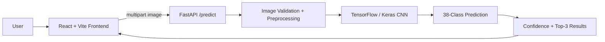

# 🌾 FasalSathi — AI Crop Disease Detection Platform

FasalSathi is an end-to-end crop disease detection application that combines a **TensorFlow/Keras image-classification model**, a **FastAPI inference backend**, and a **React + Vite frontend**.

Users can upload a plant-leaf image and receive a predicted disease class, confidence score, and top-3 model predictions through an HTTP API.

## ✨ What the Project Does

- 📷 Accepts JPG, PNG, and WEBP leaf images
- 🧠 Runs a trained CNN image-classification model
- 🔎 Predicts among 38 PlantVillage disease/healthy classes
- 📊 Returns confidence and top-3 predictions
- ⚠️ Flags predictions below a configurable confidence threshold
- 🌐 Provides a React/Vite frontend
- 🔌 Exposes a FastAPI inference API
- 🐳 Includes a Dockerfile for the backend
- 🌍 Supports configurable CORS origins through environment variables

## 🏗️ System Architecture



## 🚀 Deployment Flow


> The deployment flow describes the intended production path. The repository currently provides a containerized backend; a live production deployment should only be claimed after it is actually deployed and verified.

## 🛠️ Tech Stack

### Frontend
- React.js
- Vite
- Tailwind CSS
- Context API
- JavaScript

### Backend
- Python
- FastAPI
- Uvicorn
- Pillow
- NumPy
- Docker

### AI / ML
- TensorFlow 2.17
- Keras
- CNN image classification
- PlantVillage class labels

## 📁 Project Structure

```text
crop-disease-ai/
├── backend/
│   ├── crop_disease_model.h5
│   ├── main.py
│   ├── requirements.txt
│   └── Dockerfile
│
├── frontend/
│   ├── src/
│   ├── public/
│   ├── package.json
│   ├── pnpm-lock.yaml
│   ├── vite.config.js
│   └── .env.example
│
└── README.md
```

## 🔌 API

### Health Check

```http
GET /health
```

Returns the service state and whether the model is loaded.

### Prediction

```http
POST /predict
Content-Type: multipart/form-data
```

Upload an image using the `file` field.

Example response shape:

```json
{
  "class": "Tomato___Late_blight",
  "confidence": 0.94,
  "low_confidence": false,
  "top3": [
    {"class": "Tomato___Late_blight", "confidence": 0.94},
    {"class": "Tomato___Early_blight", "confidence": 0.03},
    {"class": "Tomato___Target_Spot", "confidence": 0.01}
  ]
}
```

## 🚀 Run Locally

### Backend

```bash
cd backend
pip install -r requirements.txt
python main.py
```

The API runs on port `7860` by default.

### Frontend

```bash
cd frontend
pnpm install
pnpm dev
```

Configure the frontend API URL using the provided `.env.example` file.

## 🐳 Docker

The backend contains a Dockerfile for containerized deployment.

```bash
cd backend
docker build -t fasalsathi-api .
docker run -p 7860:7860 fasalsathi-api
```

## ⚠️ Important ML Note

The inference code intentionally does **not** divide image pixels by 255 because the current training pipeline expects raw 0–255 pixel values. If the training preprocessing is changed, the inference preprocessing must be changed consistently as well.

## 🔐 Production Checklist

- [ ] Pin and verify the model artifact using a release or artifact store
- [ ] Restrict `ALLOWED_ORIGINS` to the deployed frontend domain
- [ ] Add automated API tests
- [ ] Add model/version metadata to prediction responses
- [ ] Add monitoring and structured request metrics
- [ ] Add stronger image validation and rate limiting
- [ ] Move large model artifacts to dedicated object storage when appropriate
- [ ] Add CI/CD for frontend and backend
- [ ] Deploy and verify a live frontend + API environment

## 📌 Current Status

The repository contains a real full-stack inference architecture with a containerized FastAPI backend. Production deployment, automated CI/CD, and additional operational hardening remain roadmap items.

## Author

**Rudra Pratap Singh**

GitHub: [@deadlyrps2802](https://github.com/deadlyrps2802)
