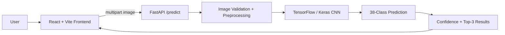

# 🌾 FasalSathi — AI Crop Disease Detection Platform

FasalSathi is an end-to-end crop disease detection application combining a **TensorFlow/Keras image-classification model**, **FastAPI inference backend**, and **React + Vite frontend**.

## 🌐 Live Demo

**Frontend:** https://crop-disease-3bdfsq74r-deadlyrps2802s-projects.vercel.app/

**API:** https://crop-disease-ai-l5td.onrender.com/

## ✨ What the Project Does

- 📷 Accepts JPG, PNG, and WEBP leaf images
- 🧠 Runs a trained CNN image-classification model
- 🔎 Predicts among 38 PlantVillage disease/healthy classes
- 📊 Returns confidence and top-3 predictions
- ⚠️ Flags low-confidence predictions
- 🌐 React/Vite frontend with Hindi/English support
- 🔌 FastAPI inference API
- 🐳 Dockerized backend
- 🌍 Configurable CORS

## 🏗️ System Architecture



## 🛠️ Tech Stack

React.js • Vite • Tailwind CSS • Python • FastAPI • Uvicorn • Pillow • NumPy • TensorFlow 2.17 • Keras • Docker

## 🔌 API

### Health Check

```http
GET /health
```

### Prediction

```http
POST /predict
Content-Type: multipart/form-data
```

Upload an image using the `file` field.

## 🚀 Run Locally

```bash
cd backend
pip install -r requirements.txt
python main.py
```

Then:

```bash
cd frontend
pnpm install
pnpm dev
```

Configure `VITE_API_URL` using `.env.example` when using a custom backend.

## ⚠️ ML Note

Inference intentionally keeps image pixels in the 0–255 range because the current training pipeline expects raw pixel values.

## 📌 Deployment

The frontend is deployed on Vercel and the FastAPI backend is deployed on Render. Both have been configured as the production demo environment.

## Author

**Rudra Pratap Singh**

GitHub: https://github.com/deadlyrps2802
